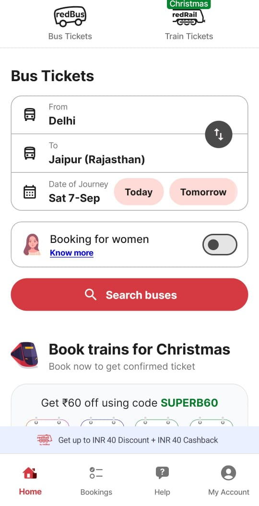
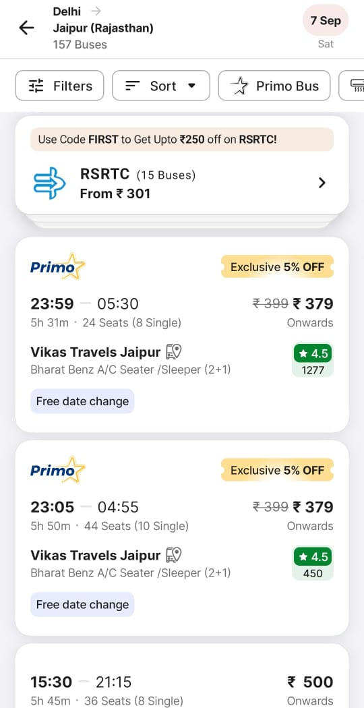
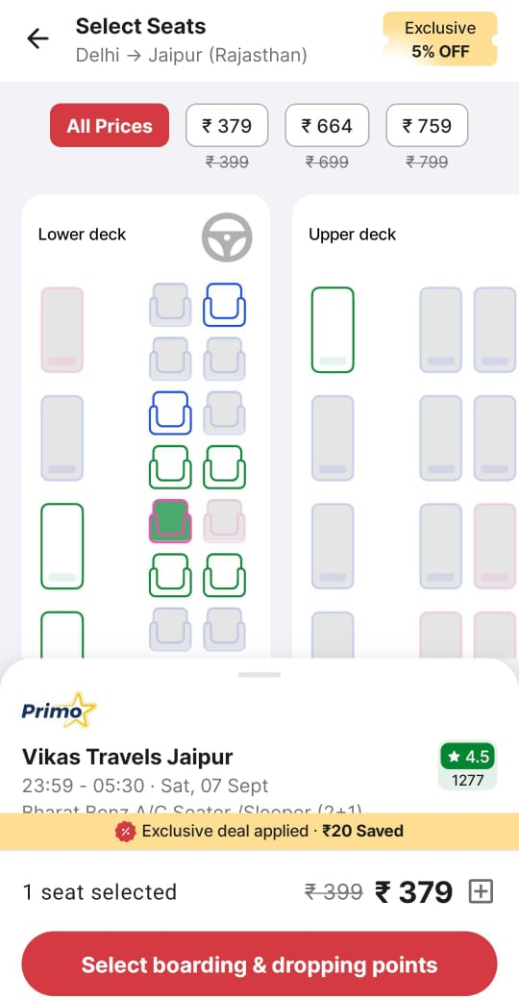
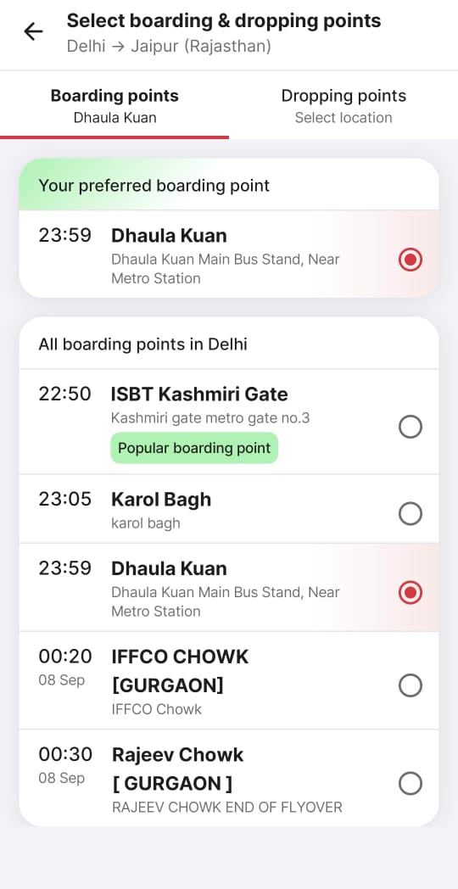
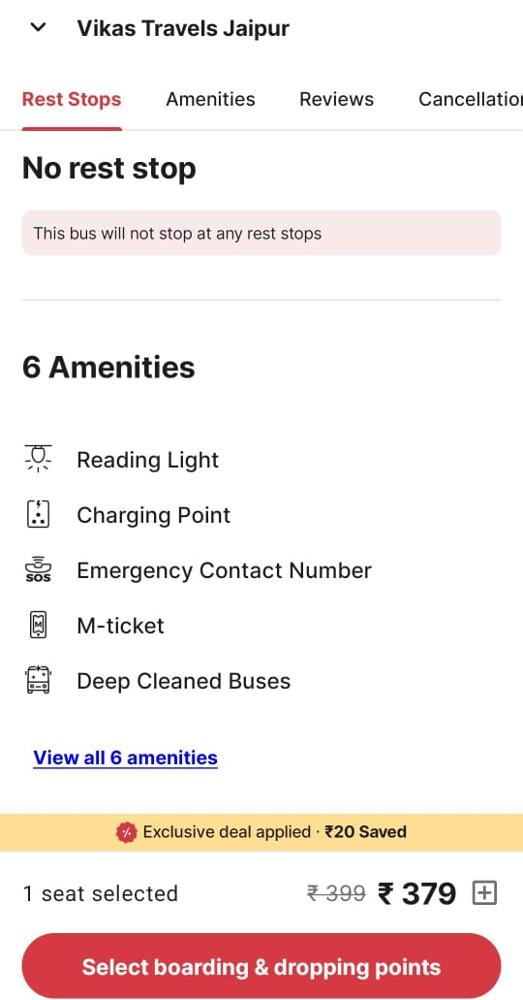
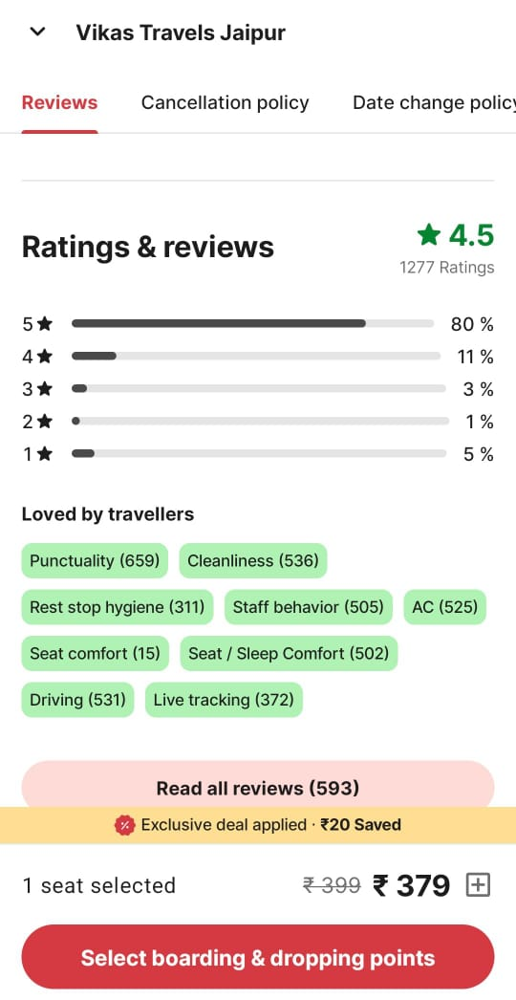
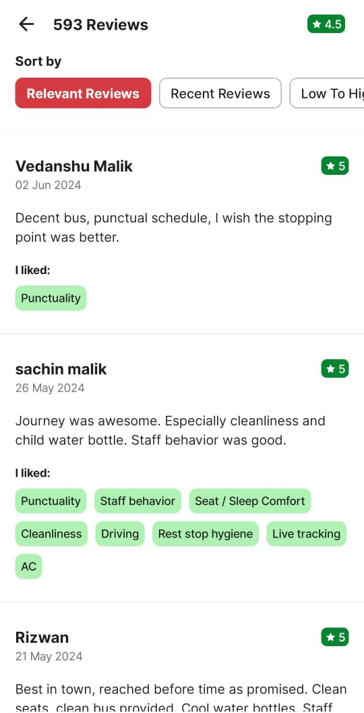
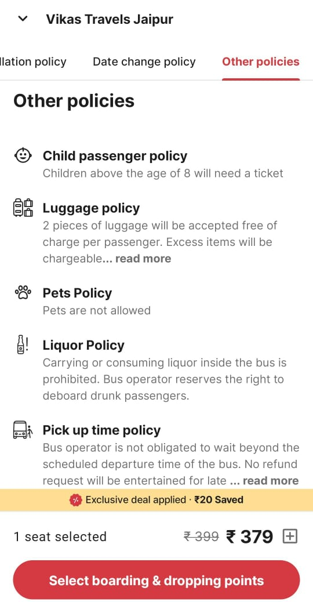

## Prompting Strategy Brief

### Objective
Analyze screenshots to generate a comprehensive test case for a specific feature or flow.

### Prompt Structure

1. **Introduction**
   - Request to analyze screenshots and create a detailed test case, referencing a sample format for guidance.

2. **Instructions**
   - Specify that the test case should cover all elements visible in the screenshots, including detailed steps and expected results.

### Detailed Test Case Elements

1. **Test Case ID**
   - Assign a unique identifier.

2. **Title**
   - A brief, descriptive title of the test case.

3. **Description**
   - Explain the purpose and scope of the test case.

4. **Pre-conditions**
   - List conditions that must be met before executing the test case.

5. **Step-by-Step Instructions**
   - Provide detailed steps to perform the test, referencing exact elements in the screenshots.

6. **Expected Results**
   - Outline what should happen at each step to determine if the test passes or fails.

7. **Actual Results**
   - To be filled during testing.

8. **Status**
   - Mark as Pass/Fail based on actual results.

9. **Notes**
   - Include additional considerations, such as edge cases, error scenarios, and responsive design aspects.

### Specific Instructions

- Reference exact text, buttons, or elements from the screenshots.
- Cover flows across multiple screenshots if needed.
- Mention locations of elements on the page (e.g., header, footer).
- Consider responsive design for different device views.
- Verify interactive elements like buttons and forms.

### redBus App Screenshots

### Myracle Web App Screenshots

.png)
.png)
